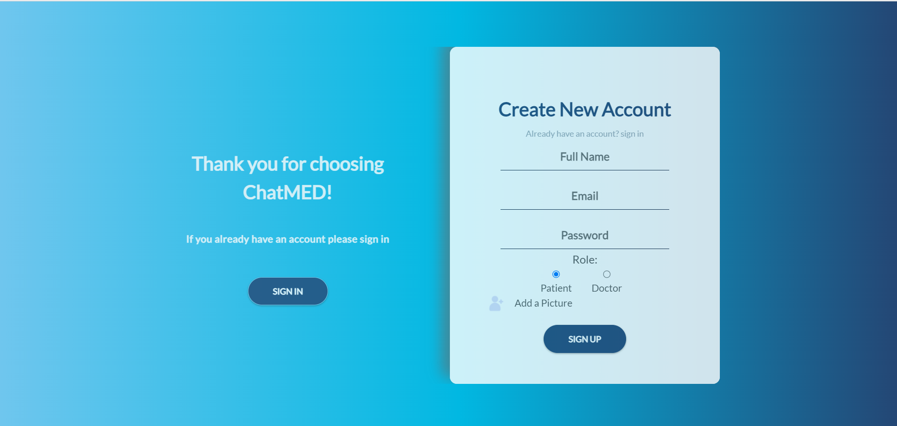
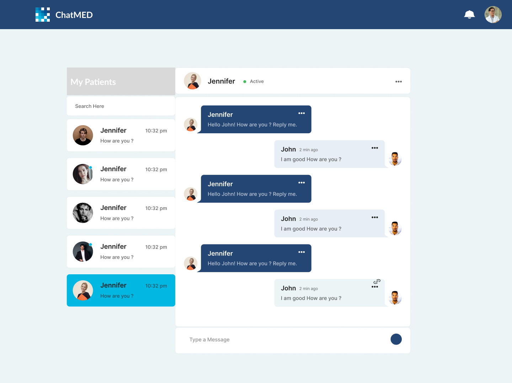
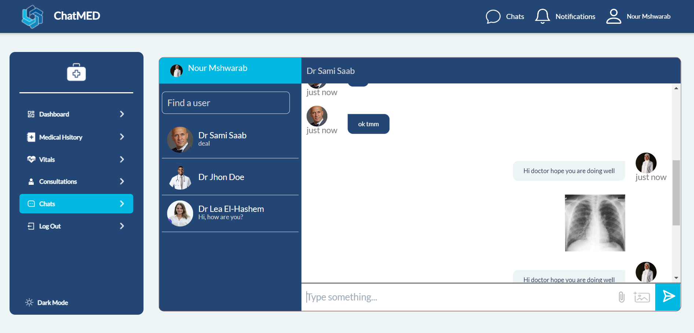
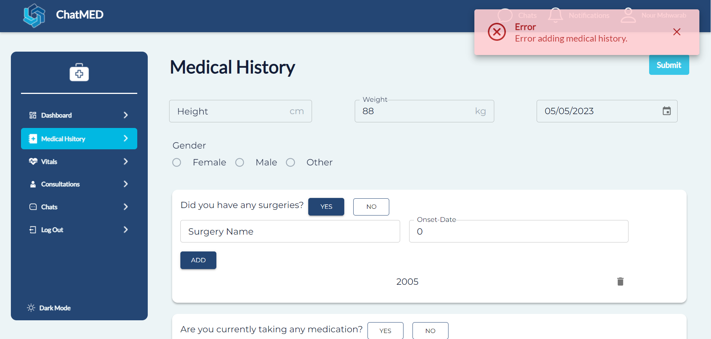
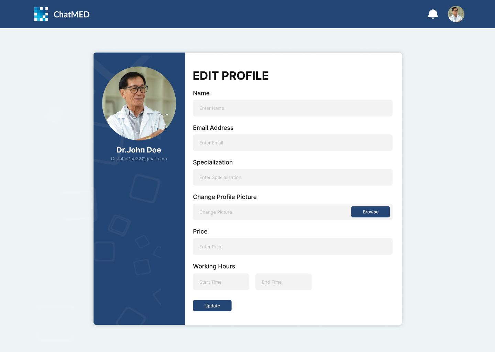
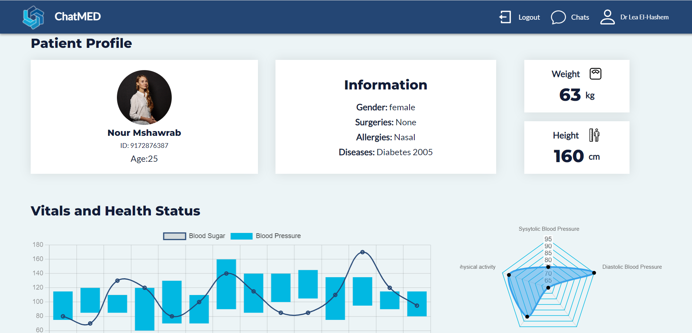
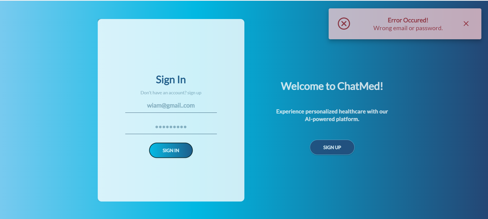
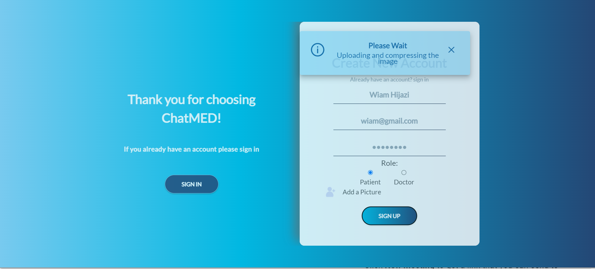

<br><br>

<!-- project philosophy -->


> A web app designed to revolutionize primary healthcare by leveraging the power of ChatGPT.
>
> Our mission is to make quality healthcare accessible to everyone while empowering individuals to stay on top of their health goals. By combining advanced technology with personalized care, ChatMED aims to bridge the gap between patients and healthcare providers.

### User Stories

- As a patient, I want to choose a doctor and enter my symptoms to a chatbot so that the doctor can check my symptoms later.
- As a user, I want to customize my order, so I can add or remove ingredients according to my preferences.
- As a patient, I want to input my vitals and receive notifications assessing my progress so that I can stay on track with my health goals.

- As a doctor, I want to receive a diagnosis and treatment plan so that I can provide medical advice to my patient.
- As a doctor, I want to conduct virtual consultations through live chat with the patient if needed.
- As a doctor, I want to view my patients along their vitals and detailed medical history.

<br><br>

<!-- Prototyping -->


> We designed Coffee Express using wireframes and mockups, iterating on the design until we reached the ideal layout for easy navigation and a seamless user experience.

### Mockups

| Home screen                                  | Authentication                        | Chats                             |
| -------------------------------------------- | ------------------------------------- | --------------------------------- |
|  |  |  |

<br><br>

<!-- Implementation -->


> Using the mockups as a guide, we implemented ChatMED app with the following features:

### Patient Screens

| Live Chats                                | Medical History                     | Profile                                 |
| ----------------------------------------- | ----------------------------------- | --------------------------------------- |
|     |  |      |
| View Patient                              | Login                               | Register                                |
|  |    |  |

<br><br>

<!-- Tech stack -->


### ChatMED is built using the following technologies:

- For unit testing, this project uses [jest](https://jestjs.io/) which is a JavaScript testing framework that supports Typescript.
- This project uses the [React JS development framework](https://reactjs.org/). React is a declarative, efficient, and flexible JavaScript library for building SPA (single web application) and user interfaces or UI components. It lets you compose complex UIs from small and isolated pieces of code called “components”.
- For styling i used [SCSS Modules](https://sass-lang.com/) along [Primeract](https://primereact.org/) which provided a flexible design pattern.
- For live messages, the project uses the [Firebase](https://firebase.google.com/).
- The project uses the font ["Montserrat"](https://fonts.google.com/specimen/Montserrat) as its main font, and the design of the app adheres to the material design guidelines.
- For persistent storage (database), this project uses the [MongoDB](https://www.mongodb.com/) package which allows the app to create a custom storage schema and save it to a local database.
- This project uses [Node.js](https://nodejs.org/) a JavaScript runtime built on Chrome's V8 JavaScript engine as a backend infrastructure and [Express](https://expressjs.com/) framework which is a minimal and flexible Node.js web application framework that provides a robust set of features for web and mobile applications.

<br><br>

<!-- How to run -->


> To set up ChatMED locally, follow these steps:

### Prerequisites

This is an example of how to list things you need to use the software and how to install them.

- npm
  ```sh
  npm install npm@latest -g
  ```

### Installation

_Below is an example of how you can instruct your audience on installing and setting up your app. This template doesn't rely on any external dependencies or services._

1. Clone the repo
   ```sh
   git clone https://github.com/MoeShoumar/ChatMED
   ```
   Here you will find three folders (frontend, backend, and test)
2. Inside the frontend folder, run:

   ```sh
   npm install
   ```

3. Inside the backend folder, run:
   ```sh
   npm install
   ```
4. Set your `DB_CONNECT` to your MongoDB connection URL and add your `TOKEN_SECRET`.

5. Inside the socket folder, run:

   ```sh
   npm install socket.io
   ```

6. You are ready to go, inside the backend folder, the frontend folder and the socket folder, run:
   ```sh
   npm start
   ```
